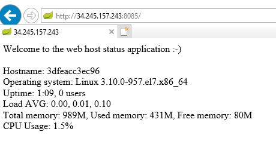

# Simple java sprint web application + CI/CD using jenkins, maven and docker

## Application description:
This web application based on java and spring.  
Originally, initiated using this website: https://start.spring.io/ it's a very good site, highly recommended.  
  
The app is a very simple web page which shows very basic host details such as:
* Hostname
* Operating system
* CPU% usage
* Memory status
* etc  
  
Scroll down to the bottom of this README for screenshot.

## Project description:
1. Runs a CI flow for the application
2. Build and deploy the project on a docker container
3. Final output: a user will access your web application, and see the new changes (without any action what so ever from his side)

## Prerequisites
----
### Prerequisites - application (codewise):  
1. Project is based on Java (1.8) and including tests  
2. Code should be pushed to Github (public repo)

### Prerequisites - servers
Two/Three servers:
1. Orechestrator machine (ubuntu/redhat/any linux) - must have Jenkins.
2. CI server - RedHat server, jdk 1.8, maven (3.3.9 is good), git, docker
3. optional: deployment server (there you'll need only docker, but you will have to modify the Jenkinsfile to copy the docker image to this server and run container over there).

### Prerequisites - network
1. Configure security groups:
- allow SSH access to all machines
- port 8085 for the application (CI machine or deployment machine)
- Your Jenkins port for the orchestrator machine (8080/8081/http/https/whicever you choose)
2. SSH access - configure a way to access with ssh (an opened user with password,or pem key file or any other method)
3. On the Jenkins - configure a node which runs on the CI server ('host_ci') , and on the deployment server if you have any.

### Prerequisites - Github 
1. Add <jenkins url>/github-webhook/ to Github Webhooks.
2. Security group - expose TCP 8080 access (or your Jenkins app port) from Github ip

### Prerequisites - Jenkins
1. In Jenkins ui - install plugins: github-plugin, git plugin (should come already with the jenkins by default)
5. In the node 'host_ci' configuration - check "Environment variables" and add variable named 'M2_HOME' and value maven dir on the ci server. 

----
# CI/CD 
Creation of CI/CD job:
* Create a new pipeline job in Jenkins. job configuration:   
  - Pipeline definition - Pipeline script from SCM
  - SCM - git
  - Repository URL - the link to current repository.
  - Credentials - none.
  - After saving configuration, run job manually once.
    ## CI:  
      - Job is being triggered on any push event on git repository.
      - git pull   
      - Build the project and run all the tests.
      - Build the docker image which contains the spring application.
    ## CD:  
      - Runs a docker container using the image from above.
  
Screenshot below:  
  
  

# Final output:
User can access your application via web browser, going to the deployment IP address:8085  
(unless you changed the port in the Dockerfile or in the docker run command in the Jenkinsfile).  
Screenshot below:  

### Ehe end :) ENJOY...
